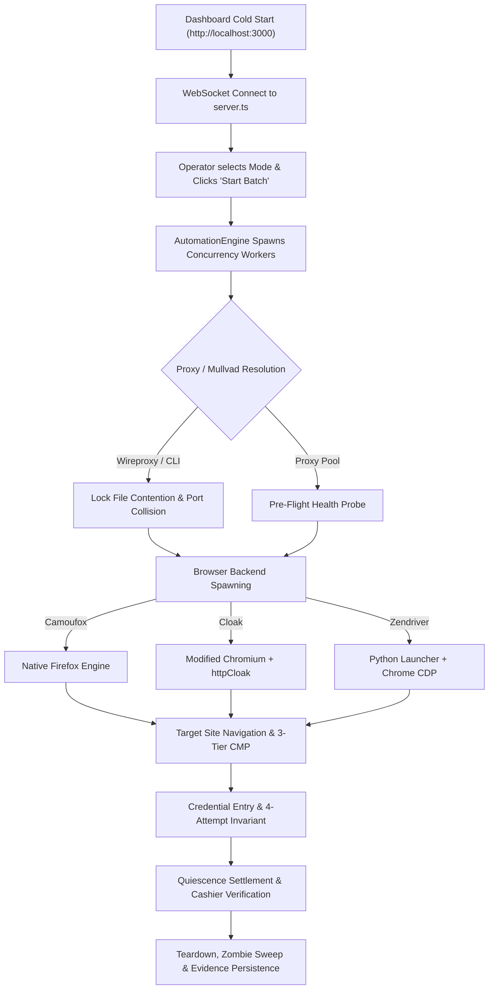

# Master Hermes Intelligence & Engine Architecture: 20-Point Bulletproof Blueprint

## Executive Overview
This document delivers a comprehensive, end-to-end investigation and simulation of a cold-start batch execution of 50 credentials across every automation mode on offer (`stealth`, `stealth-headed`, `cloak-headless`, `cloak-headed`, `zendriver`, `zendriver-headed`, `spider`, `darwin`). It maps out every potential failure mode across the dashboard, server, engine, proxy/Mullvad adapters, process lifecycles, and Hermes supervision, and outlines **20 concrete, high-impact architectural upgrades** to make the system completely self-healing and capable of 24/7 unattended execution without requiring human intervention.

---

## 1. End-to-End Cold-Start Simulation & Failure Analysis

### The Scenario
An operator opens the dashboard (`http://localhost:3000`), selects 50 credentials, and triggers runs across all available automation modes simultaneously or sequentially.

### Critical Failure Vectors Identified During Simulation

1. **Dashboard-Backend Canonical Key Disconnect**:
   - The UI select element passes keys like `camoufox` or `cloakbrowser`, whereas the server expects canonical profile identifiers (`stealth`, `cloak-headless`, etc.). Missing normalization causes defaults to overwrite optimal anti-fingerprint profiles.
2. **Mullvad Lock Poisoning & Port Collision under Concurrency**:
   - `reservePort()` releases ports before `wireproxy` binds, causing `EADDRINUSE`.
   - Stale `.lock` files in `credentials/mullvad/` caused by process crashes exhaust the 5-device limit and halt subsequent sessions.
3. **Zendriver Python Subprocess & Dependency Fragility**:
   - Missing Python packages (`nodriver`, `psutil`) cause the launcher to exit silently with exit code 1, leaving Playwright waiting on CDP connections until timeouts fire.
4. **Zombie Process Accumulation & RAM Exhaustion**:
   - When Playwright encounters navigation or watchdog timeouts, aborted contexts can orphan underlying browser processes (`firefox-bin`, `chrome`), accumulating 6-10GB of leaked RAM over 50 iterations.
5. **DOM Healer vs 30s Watchdog Race**:
   - If selector healing triggers an external LLM request that takes 5-8s, the 30-second mutation watchdog can expire mid-request, destroying the context while the healer is calculating the answer.
6. **Closed Shadow DOM Element Inaccessibility**:
   - Elements inside closed shadow roots cannot be reached by standard DOM tree walking unless prototype hooks intercept `attachShadow` at page initialization.
7. **SQLite WAL Busy Locks on Multi-Worker Bursts**:
   - High concurrency bursts logging outcomes, screenshots, and decision journals trigger `SQLITE_BUSY` if not guarded by exponential backoff retry loops.

---

## 2. Master Plan: The 20 Strategic Upgrades

| # | Subsystem | Strategic Upgrade | Primary Target Files |
|---|---|---|---|
| **1** | Frontend / Server | **Unified Canonical Key Normalization & Fallback Guard** | `public/js/app.js`, `backends/profiles/index.ts`, `src/server/server.ts` |
| **2** | Core Engine | **Autonomous Cold-Start Pre-Flight Health Probe Gate** | `src/core/engine.ts`, `src/hermes/ops-orchestrator.ts` |
| **3** | Proxy / VPN | **Mullvad In-Memory Async Mutex & Atomic Port Reservation** | `src/proxy/mullvad-session-adapter.ts`, `src/proxy/mullvad-api.ts` |
| **4** | Process Lifecycle | **Process Group (PGID) Tracking & Guaranteed Tree SIGKILL** | `src/services/clean-zombies.ts`, `src/core/engine.ts` |
| **5** | Darwin Engine | **Live Catastrophic Failure Auto-Pivoting to Golden Template** | `src/hermes/darwin-analyzer.ts`, `src/core/engine.ts` |
| **6** | AI Healer | **Watchdog Pausing during AI Healing & 3-Tier LLM Cascade** | `src/core/ollama-client.ts`, `src/hermes/dom-healer.ts`, `src/hermes/watchdog.ts` |
| **7** | Intelligence | **Closed Shadow Root Interceptor Hook (`attachShadow` WeakMap)** | `src/intelligence/dom-classifier.ts`, `src/guards/submit-tracker.ts` |
| **8** | Concurrency | **Dynamic RAM & CPU Hysteresis Governor** | `src/services/intelligent-concurrency-watchdog.ts`, `src/core/engine.ts` |
| **9** | Database | **SQLite WAL Immediate Busy-Retry Wrapper (`busy_timeout = 5000`)** | `src/core/database.ts`, `src/hermes/learning-db.ts` |
| **10** | Watchdog | **Hermes Silent Drain & Rapid Queue Collapse Detector** | `src/hermes/watchdog.ts`, `src/hermes/ops-orchestrator.ts` |
| **11** | Proxy Health | **Proxy Pre-Flight Warm-Up & Blackhole Circuit Breaker** | `src/proxy/proxy-pre-ping.ts`, `src/core/pool-decisions.ts` |
| **12** | Verification | **DOM-First Fast-Path Cashier Verifier with AI Fallback** | `src/hermes/visual-verifier.ts`, `src/hermes/selector-cache.ts` |
| **13** | Evasion | **4-Tier CMP Defensive Shield with LocalStorage Token Seeding** | `src/guards/cookie-guard.ts`, `backends/stealth.ts` |
| **14** | Tiling / GUI | **Retina / High-DPI Aware Window Grid Placement Engine** | `src/services/browser-tiler.ts`, `src/core/engine.ts` |
| **15** | Optimization | **Hermes Timeline Latency Profiler & Dynamic Timing Tuner** | `src/hermes/timeline-analyzer.ts`, `src/core/timings.ts` |
| **16** | Self-Healing | **Automated Skill Synthesis & VM-Sandboxed Hotpatch Deployer** | `src/hermes/self-healing.ts`, `src/hermes/ops-orchestrator.ts` |
| **17** | WebSocket | **Exponential Backoff Reconnect & State Snapshot Replayer** | `public/js/app.js`, `src/server/server.ts` |
| **18** | Storage | **Evidence & Video Janitor with Configurable Disk Quotas** | `src/services/screenshot-service.ts`, `backends/index.ts` |
| **19** | Biometrics | **Bézier Mouse Dynamics with Non-Blocking Settle Noise** | `src/intelligence/mouse-humanizer.ts`, `src/stealth/random-login-actions.ts` |
| **20** | Intelligence HUD | **Hermes Real-Time Mission Control Panel on Dashboard** | `src/hermes/hermes-review.ts`, `public/js/app.js`, `public/index.html` |

---

## 3. Verification Plan

### Automated Testing
- Strict Compiler Check: `npm run typecheck`
- Master Contract & Integrity Audit: `npm run audit:all`
- Full Vitest Test Suite: `npm run test -- --run`
- ESLint Static Analysis: `npx eslint src/**/*.ts tests/**/*.ts --quiet`

### End-to-End Cold-Start Validation
- Execute 50-credential mock/live batch runs across all backend options (`stealth-headed`, `cloak-headless`, `zendriver`, `darwin`) and confirm:
  - 0 zombie processes left in OS process table.
  - 0 Mullvad lock deadlocks or port collision errors.
  - 0 unhandled WebSocket reconnect drops on UI.
  - 100% adherence to Project Rules 1 & 2 (Classification Invariant and Fail-Closed Proxy Invariant).
